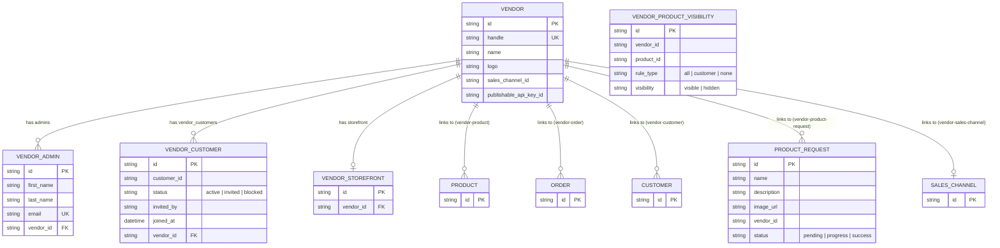

# Database Diagram Stage

This markdown file contains the current Database ER diagram of the Medusa application, particularly focusing on the marketplace extensions and relations.

```mermaid
erDiagram
    %% Core Marketplace Models
    VENDOR {
        string id PK
        string handle UK
        string name
        string logo
        string sales_channel_id
        string publishable_api_key_id
    }
    
    VENDOR_ADMIN {
        string id PK
        string first_name
        string last_name
        string email UK
        string vendor_id FK
    }
    
    VENDOR_CUSTOMER {
        string id PK
        string customer_id
        string status "active | invited | blocked"
        string invited_by
        datetime joined_at
        string vendor_id FK
    }
    
    VENDOR_STOREFRONT {
        string id PK
        string vendor_id FK
    }

    VENDOR_PRODUCT_VISIBILITY {
        string id PK
        string vendor_id
        string product_id
        string rule_type "all | customer | none"
        string visibility "visible | hidden"
    }

    PRODUCT_REQUEST {
        string id PK
        string name
        string description
        string image_url
        string vendor_id
        string status "pending | progress | success"
    }

    %% Medusa Core Models (Linked)
    PRODUCT {
        string id PK
    }
    ORDER {
        string id PK
    }
    CUSTOMER {
        string id PK
    }
    SALES_CHANNEL {
        string id PK
    }

    %% Relationships within Marketplace module
    VENDOR ||--o{ VENDOR_ADMIN : "has admins"
    VENDOR ||--o{ VENDOR_CUSTOMER : "has vendor_customers"
    VENDOR ||--o| VENDOR_STOREFRONT : "has storefront"

    %% Links to other modules (via Medusa Links)
    VENDOR ||--o{ PRODUCT : "links to (vendor-product)"
    VENDOR ||--o{ ORDER : "links to (vendor-order)"
    VENDOR ||--o{ CUSTOMER : "links to (vendor-customer)"
    VENDOR ||--o{ PRODUCT_REQUEST : "links to (vendor-product-request)"
    VENDOR ||--o| SALES_CHANNEL : "links to (vendor-sales-channel)"

```
